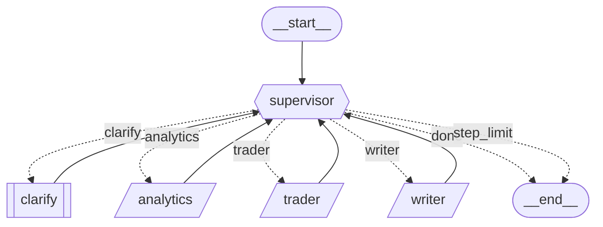

# instrument-analysis

A broker-side LangGraph agent. You ask in free text for an analysis of an instrument — market
news, the chart, or both — and it produces a single Word document in whatever language you
wrote in.

Built as an explicit `StateGraph` with conditional edges. Agents are **not** tools and the
supervisor is **not** a tool-calling agent; LangGraph's prebuilt supervisor is deliberately
not used.



| Node | Does |
|---|---|
| `supervisor` | resolves instrument, timeframe, scope and language; proposes what runs next |
| `clarify` | asks one question when the request is genuinely ambiguous, then hands back |
| `analytics` | news search over the Tavily MCP server, summarised with a source URL per claim |
| `trader` | OHLC over the MT5 MCP server → support/resistance zones → annotated PNG |
| `writer` | assembles the `.docx` via `python-docx` |

---

## Quick start

```bash
python -m venv .venv
.venv/Scripts/python.exe -m pip install -r requirements.txt   # Windows
cp .env.example .env      # then point the op:// refs at your own 1Password items
```

Run one request end to end:

```bash
op run --env-file=.env -- python -m src.main "co je nového na eurodolaru a jak vypadá graf"
```

Useful flags: `--answer TEXT` (unattended clarifications, repeatable), `--trace`
(per-superstep trace), `--json`, `--postgres` (a suspended run survives a restart),
`--thread-id`.

Exit codes: `0` a document was produced, `1` the run finished without one, `2` the run needs
a clarification and none was available.

Each agent also runs on its own, which is the fastest way to test one boundary:

```bash
op run --env-file=.env -- python -m src.agent.supervisor "co je nového na eurodolaru"
op run --env-file=.env -- python -m src.agents.trader --instrument EURUSD --timeframe H1
op run --env-file=.env -- python -m src.agents.analytics --instrument EURUSD --language cs
```

### Configuration

Secrets come from the environment only, never from code. `.env` holds 1Password `op://`
references rather than plaintext, and `op run` resolves them for one process:

| Variable | |
|---|---|
| `OPENAI_API_KEY` | required |
| `TAVILY_API_KEY` | required for the `news` and `both` scopes |
| `MT5_MCP_URL` | required for the `chart` and `both` scopes |
| `MT5_API_KEY` | optional — a local MT5 MCP server usually needs none |
| `POSTGRES_URI` | only for `--postgres` |

Everything else lives in `src/agent/config.py`: models per agent, limits, paths, and the MT5
and Tavily tool-discovery settings. Two worth setting for your own broker:

- `MT5_SERVER_UTC_OFFSET_H` — MT5 prints the server clock with no timezone, so this is what
  makes bar timestamps truthful.
- `AGENT_MODELS["supervisor"]` — the supervisor runs a larger model than the other three on
  purpose; see the note in `config.py`.

---

## Layout

```
docs/graph.md            topology — the diagram above, and the source of truth for it
docs/graph-spec.md       contracts — state schema, per-node read/write keys, router rules
docs/walkthrough.md      orientation, module by module (Czech)

src/agent/state.py       AgentState and its reducers
src/agent/config.py      models, limits, paths
src/agent/graph.py       assembly only
src/agent/supervisor.py  supervisor node + route_from_supervisor
src/agent/clarify.py     human-in-the-loop interrupt node
src/agents/analytics.py  news search + summary
src/agents/trader.py     MT5 OHLC + chart
src/agents/writer.py     document
src/agents/charting.py   level derivation + PNG, pure, no LLM
src/agents/docbuilder.py docx assembly, pure, no LLM
src/agents/mcp_client.py shared MCP transport
src/main.py              CLI entry point
```

Output lands in `outputs/charts` and `outputs/reports`, relative to the working directory,
so run from the repository root.

---

## Tests

```bash
.venv/Scripts/python.exe -m pytest -q
.venv/Scripts/python.exe -m mypy src/
```

409 cases, no network and no credentials required: MT5, Tavily and all four models are
stubbed, and everything else — the router, the reducers, the checkpointer, `charting` and
`docbuilder` — runs for real.

`tests/test_graph_topology.py` compares `docs/graph.md` against the compiled graph, so the
diagram cannot quietly stop describing the code.

---

## Design notes

The four decisions that explain most of the code:

**The router overrides the LLM.** `route_from_supervisor` is a pure function of state with
five ordered rules. The supervisor keeps exactly one judgement call — which artifact to fetch
first when both are needed. It cannot run an agent outside the requested scope, run the
writer before its inputs exist, skip the writer, or finish without a document. A runaway loop
exits via `step_limit` with inspectable state rather than a `GraphRecursionError`.

**No agent raises.** Every failure becomes an `errors` entry plus an `agent_log` line and
control returns to the supervisor. An escaping exception would kill the run and lose the
trace. The one exception is `clarify`, because `interrupt()` suspends by raising.

**Failure artifacts are present but empty, never `None`.** A dead Tavily yields
`{"summary": "", "items": []}` and a dead MT5 yields a chart sentinel with `path: None`. The
router reads a present artifact as produced, so one broken dependency degrades the report
instead of looping the agent until the step limit. With both down you still get a document
naming both gaps.

**The LLM is never in the data path.** Levels come from `charting.py`, a pure function of the
OHLC frame — same bars in, same levels out, so a chart is reproducible from a checkpoint. MCP
tool discovery and argument mapping are deterministic string matching. The models write prose
about numbers they did not compute, classify a request, and nothing else.

---

## Versions

Pinned exactly in `requirements.txt` — the LangGraph API moves between minors. Verified
against `langgraph==1.2.11`, `langchain-core==1.5.6`, `langchain-openai==1.5.1`, `mcp==2.0.0`,
`matplotlib==3.11.1`, `python-docx==1.2.0`.
