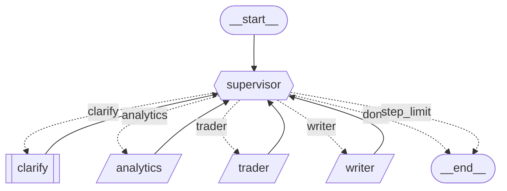

# Instrument analysis graph

```mermaid
---
config:
  layout: dagre
---
flowchart TB
    START(["__start__"]) --> supervisor{{supervisor}}
    supervisor -. clarify .-> clarify[[clarify]]
    supervisor -. analytics .-> analytics[/analytics/]
    supervisor -. trader .-> trader[/trader/]
    supervisor -. writer .-> writer[/writer/]
    clarify --> supervisor
    analytics --> supervisor
    trader --> supervisor
    writer --> supervisor
    supervisor -. done .-> END(["__end__"])
    supervisor -. step_limit .-> END
```
